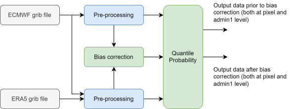

# Data Processing

* [Setup](#setup)
* [Clean-up](#clean-up)



### Setup

Docker image is built by default with `mapaction` user and group name, and the ids set to `1000`. To change it, create new `.env` file in top directory, copy content of `.env.example` file into it, and change the variables to your prefered values.

build Docker image

```bash
make docker-build
```

start Docker container

```bash
make docker-run
```

when inside of Docker container, install Poetry dependencies

```bash
make clean .venv
```

> **NOTE:** You will have to install the dependencies each time you start the Docker container. That is by design, so the Docker image does not have stored stale dependency chain.

run `jupyterlab`

```bash
poetry run jupyter lab
```

### Clean-up

once you have finished your work, and terminated `jupyterlab`

terminate the container, by exit from it's console

```bash
exit
```

when Dockerfile is updated, you can rebuild the image by running

```bash
make docker-clean docker-build
```

Docker cache can take up huge amount of storage over time.  

check how much disk space is Docker using

```bash
docker system df
```

remove build cache

```bash
docker buildx prune -f
```

you can also check for any unused Docker images

```bash
docker image ls
```

and remove them by running

```bash
docker image rm <image-id>
```
